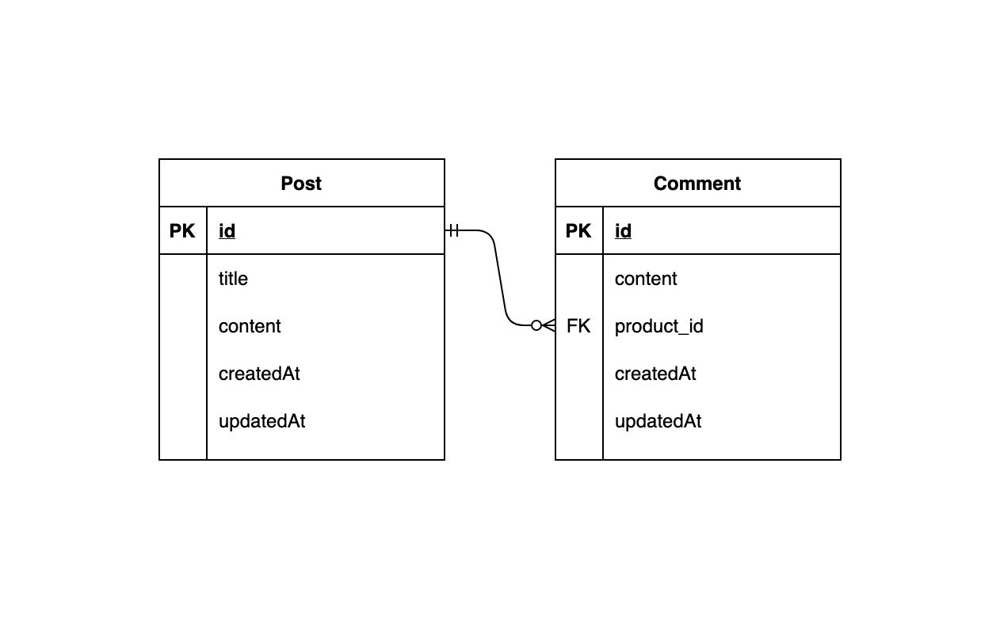
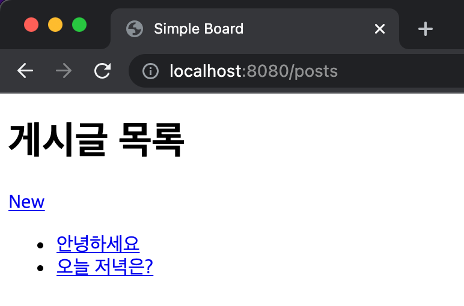
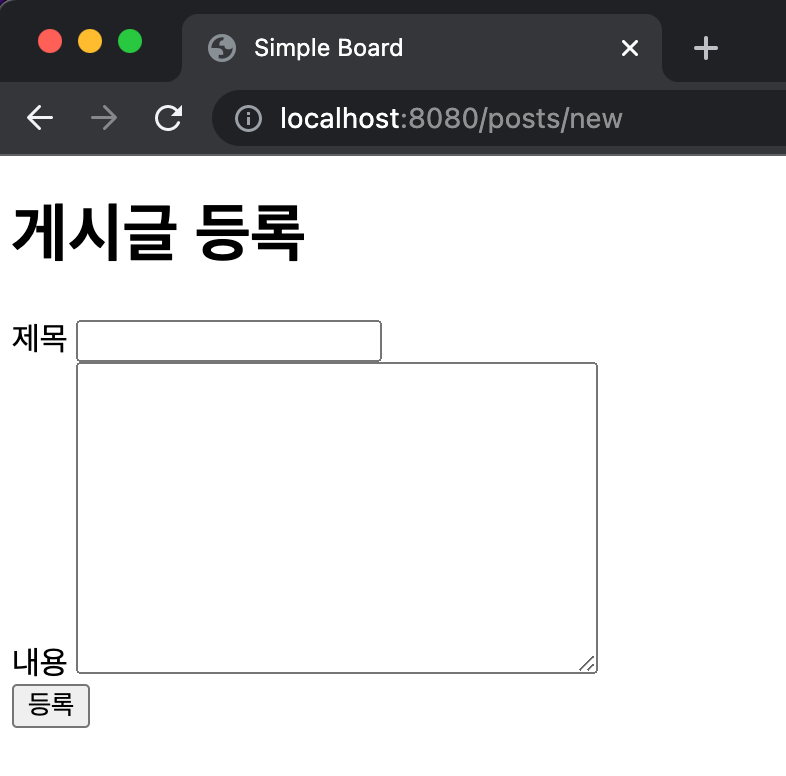
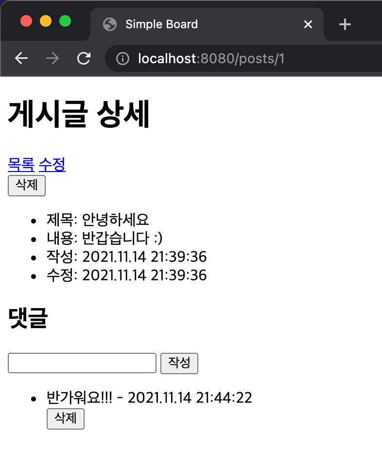
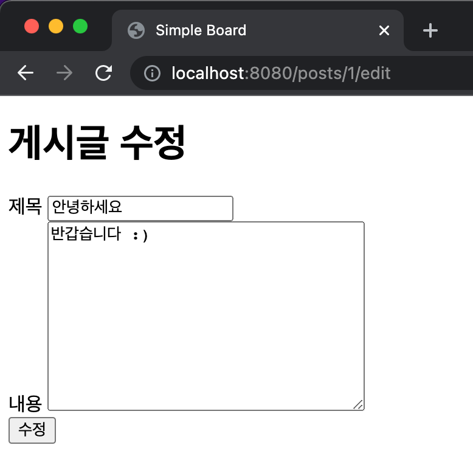

# Simple Board

## 개요

- 게시글과 댓글을 조회, 생성 및 삭제 할 수 있는 Spring Boot Web Application 구현

## 목표

- Spring Data JPA를 활용한 Database 조작
- Template Engine(Thymeleaf)의 활용

## 준비 사항

- Spring Boot >= 2.4
- DBMS (택 1 / Docker 또는 Local 설치)

    - MySQL Server >= 8.0
        - Docker
          
            ```bash
            $ docker run --name project-02 \
              -e MYSQL_ROOT_PASSWORD=root \
              -e MYSQL_USER=coupang \
              -e MYSQL_PASSWORD=coupang \
              -e MYSQL_DATABASE=project-02 \
              -p 3306:3306 -d mysql:8.0
            ```

    - PostgreSQL >= 13
        - Docker

            ```bash
            $ docker run --name project-02 \
              -e POSTGRES_USER=coupang \
              -e POSTGRES_PASSWORD=coupang \
              -e POSTGRES_DB=project-02 \
              -p 5432:5432 -d postgres:13
            ```


## 요구 사항

### 0. 주의 사항

- CSS를 이용한 레이아웃의 스타일링은 **선택적으로** 진행
- '구현 예시'는 참고 용도로만 제공되는 것이며, 반드시 **똑같이 구현할 필요 없음**
- 아래의 명세에 명시되지 않은 내용은 **자유롭게** 구현

### 1. Database Scheme

- 게시글(Post)은 제목(title)과 내용(content)으로 구성
- 댓글(Comment)는 내용(content)과 어떤 게시글의 댓글인지(post_id)에 대한 값으로 구성
- 게시글과 댓글은 각각 작성 시간(createdAt), 수정 시간(updatedAt)을 포함
- Entity Relationship Diagram (ERD)

    

### 2. Views

**2.1. 게시글 조회**

- Database에 저장된 모든 게시글의 제목과 내용을 조회
    - 이 때, 내용은 50자까지만 표시되도록 구현
- 특정 게시글을 클릭하면 해당 게시글의 상세 페이지로 이동
- 게시글 작성 페이지로 이동하는 링크 존재
- 구현 예시

    

**2.2. 게시글 등록**

- 제목과 내용을 입력 받아 새로운 게시글을 생성
- 구현 예시

    

**2.3. 게시글 상세**

- 특정 게시글의 모든 정보와 해당 게시글의 모든 댓글을 조회
- 게시글 목록 View, 게시글 수정 View로 가는 링크 및 해당 게시글을 삭제하는 버튼 존재
- 댓글의 작성 및 삭제가 가능
- 구현 예시

    

**2.4. 게시글 수정**

- 특정 게시글의 제목, 내용을 수정
- 구현 예시

    


**2.5. 게시글 삭제**

- 게시글 상세 View에서 삭제 버튼 클릭 시, 해당 게시글 삭제
- 게시글이 삭제될 경우, 해당 게시글에 작성된 댓글의 처리는 자유롭게 구현


## 제출 방법

- Git을 통해 프로젝트 URL의 GitHub repository를 로컬로 clone

    ```bash
    $ git clone https://github.com/coupang-edu/c4e-springboot-project-02
    $ cd c4e-springboot-project-02
    ```

- 본인의 `사내 이메일의 아이디 부분`으로 branch 생성 및 이동

    ```bash
    $ git switch -c john
    ```

- 코드 작성이 완료된 프로젝트를, 아래와 같이 프로젝트 폴더명을 본인의 영문명으로 변경

    ```bash
    README.md
    john/
        ├── gradle/
        ├── src/
        ├── build.gradle
        ├── gradlew
        ├── gradlew.bat
        └── settings.gradle
    ```

- 코드 작성 완료 후, 해당 branch를 push

    ```bash
    $ git push origin john
    ```

- Pull Request 생성하여 제출 완료
